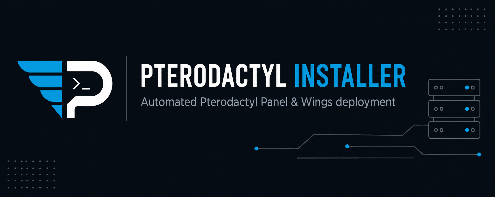

<div align="center">



<br>

<a href="https://github.com/thexento/pterodactyl-installer">
</a>

# Pterodactyl Installer

**A production-grade Linux installer for Pterodactyl Panel, Wings, and related services.**

<p>
  <a href="https://github.com/thexento/pterodactyl-installer/releases">
    
  </a>
  <a href="https://www.gnu.org/licenses/gpl-3.0.html">
    
  </a>
  
  
  
  
</p>

<p>
  <a href="https://pterodactyl-installer.xento.us.kg">Website</a>
  ·
  <a href="https://github.com/thexento/pterodactyl-installer">Repository</a>
  ·
  <a href="https://pterodactyl.io/">Pterodactyl</a>
</p>

</div>

---

## Overview

**Pterodactyl Installer** is a modular Linux shell installer built to automate the deployment, configuration, maintenance, health checking, and safe removal of a Pterodactyl environment.

It provides a single entrypoint for managing:

- Pterodactyl Panel
- Pterodactyl Wings
- Panel + Wings on a single VPS
- phpMyAdmin
- System service health checks
- Safe component uninstallation with automatic backups

The project is designed with strict Bash error handling, credential masking, architecture awareness, service validation, and both interactive and non-interactive workflows.

> This is an independent open-source project maintained by XENTO. It is not affiliated with, endorsed by, or officially supported by the Pterodactyl Project.

---

## Quick Install

Run the installer directly on your VPS:

```bash
bash <(curl -fsSL https://pterodactyl-installer.xento.us.kg/install.sh)
```

Or use the GitHub-hosted installer:

```bash
bash <(curl -fsSL https://raw.githubusercontent.com/thexento/pterodactyl-installer/main/install.sh)
```

The interactive installer provides a menu for installation, management, health checks, and removal.

### Non-Interactive Usage

Install the Panel:

```bash
bash install.sh panel
```

Install Wings:

```bash
bash install.sh wings
```

Install Panel and Wings together:

```bash
bash install.sh both
```

Install phpMyAdmin:

```bash
bash install.sh phpmyadmin
```

Check service health:

```bash
bash install.sh status
```

Launch the uninstaller:

```bash
bash install.sh uninstall
```

---

## Features

### Panel

- PHP 8.3 with required extensions
- MariaDB
- Redis
- Nginx
- Composer v2
- Automated Panel deployment
- Laravel environment configuration
- Database migrations and seeding
- Administrator account creation
- Queue worker via systemd
- Cron scheduling
- Nginx virtual host configuration
- Optional Let's Encrypt SSL

### Wings

- Docker Engine CE
- Docker CLI
- containerd
- Docker Buildx
- Docker Compose plugins
- Architecture-aware Wings binary
- systemd service
- Firewall configuration
- Optional Panel API configuration
- Manual configuration fallback

### phpMyAdmin

- phpMyAdmin 5.2.x
- Secure `blowfish_secret` generation
- Dedicated Nginx configuration
- Permission configuration

### Reliability

- Strict Bash error handling
- OS and architecture detection
- `apt` and `dnf` support
- Credential masking in logs
- Configuration validation
- Service health checks
- Timestamped backups
- Safe uninstall confirmation
- Component-specific removal
- Interactive and non-interactive operation

---

## Supported Operating Systems

| Operating System | Versions |
|------------------|----------|
| Ubuntu | 22.04 LTS, 24.04 LTS |
| Debian | 11, 12 |
| Rocky Linux | 8, 9 |
| AlmaLinux | 8, 9 |

### Architectures

| Architecture | Status |
|--------------|--------|
| `x86_64` / `amd64` | Supported |
| `aarch64` / `arm64` | Supported |

### Recommended Resources

| Deployment | CPU | RAM | Storage |
|------------|-----|-----|---------|
| Panel only | 1 core | 1 GB | 10 GB |
| Wings only | 1 core | 2 GB | 20 GB |
| Panel + Wings | 2 cores | 2 GB | 25 GB |

Wings storage requirements depend heavily on the number and type of game servers being hosted.

---

## Installation Modes

The main installer supports the following operations:

| Command | Description |
|---------|-------------|
| `panel` | Install Pterodactyl Panel |
| `wings` | Install Pterodactyl Wings |
| `both` | Install Panel and Wings on the same machine |
| `phpmyadmin` | Install phpMyAdmin |
| `status` | Check installed service health |
| `uninstall` | Launch the safe uninstaller |

Running `install.sh` without an argument opens the interactive menu.

---

## What Gets Installed

### Panel Stack

```text
Pterodactyl Panel
├── PHP 8.3
├── Composer v2
├── MariaDB
├── Redis
├── Nginx
├── Queue Worker
├── Cron
└── Certbot (optional)
```

### Wings Stack

```text
Pterodactyl Wings
├── Docker Engine CE
├── Docker CLI
├── containerd
├── Docker Buildx
├── Docker Compose
└── Wings systemd service
```

---

## Architecture

The project uses a modular shell architecture so that individual components can be maintained without turning the main entrypoint into a monolithic script.

```text
pterodactyl-installer/
├── install.sh
├── README.md
├── index.html
├── assets/
│   ├── pteroinstaller-logo.png
│   └── pteroinstaller-banner.png
└── scripts/
    ├── common.sh
    ├── panel.sh
    ├── wings.sh
    ├── phpmyadmin.sh
    └── uninstall.sh
```

### `install.sh`

The main entrypoint.

Responsible for:

- CLI argument handling
- Interactive menu
- Module dispatch
- Installation orchestration

### `scripts/common.sh`

Shared functionality for:

- OS detection
- Architecture detection
- Package management
- Input validation
- Password generation
- Logging
- Credential masking
- Firewall helpers
- systemd helpers
- Common installation utilities

### `scripts/panel.sh`

Handles the Pterodactyl Panel stack, including PHP, MariaDB, Redis, Nginx, Composer, Laravel configuration, queue workers, cron, and SSL.

### `scripts/wings.sh`

Handles Docker, the Wings binary, systemd, firewall configuration, and optional automatic node configuration.

### `scripts/phpmyadmin.sh`

Installs and configures phpMyAdmin with a dedicated Nginx configuration.

### `scripts/uninstall.sh`

Provides controlled component removal with explicit confirmation and automatic backups.

---

## Panel Installation

The Panel installer collects the information required to configure the application and then performs the required deployment steps.

### Configuration

Depending on the selected setup, the installer can request:

- Domain or IP address
- Administrator email
- Administrator username
- Administrator name
- Administrator password
- Timezone
- SSL preference

The installer generates secure database credentials and configures the Panel environment.

### Panel Setup Flow

```text
System Detection
      |
      v
Dependencies
      |
      v
PHP 8.3
      |
      v
MariaDB + Redis
      |
      v
Pterodactyl Panel
      |
      v
Laravel Configuration
      |
      v
Database Migration
      |
      v
Administrator Account
      |
      v
Queue Worker + Cron
      |
      v
Nginx
      |
      v
Optional SSL
```

---

## Wings Installation

Wings provides the daemon responsible for running Pterodactyl server workloads.

The installer handles:

- Docker Engine CE
- Docker CLI
- containerd
- Buildx
- Compose plugins
- Wings binary
- systemd service
- Firewall configuration

The correct Wings binary is selected according to the server architecture.

### Automatic Configuration

Where supported, the installer can configure Wings using:

- Panel URL
- API token
- Node ID

### Manual Configuration

If automatic configuration is skipped or unavailable, obtain the Wings configuration from the Panel and place it at:

```text
/etc/pterodactyl/config.yml
```

Then start Wings:

```bash
systemctl start wings
```

---

## Panel + Wings

A single VPS can host both the Panel and Wings:

```bash
bash install.sh both
```

After installation, create the node through the Pterodactyl Panel:

1. Open the Panel.
2. Go to **Admin → Nodes**.
3. Create a node.
4. Open the node's configuration.
5. Copy the generated Wings configuration.
6. Save it as:

```text
/etc/pterodactyl/config.yml
```

7. Start Wings:

```bash
systemctl start wings
```

The exact configuration process may vary with the installed Pterodactyl version.

---

## phpMyAdmin

Install phpMyAdmin with:

```bash
bash install.sh phpmyadmin
```

The installer:

- Installs phpMyAdmin 5.2.x
- Generates a secure random `blowfish_secret`
- Creates the required directory
- Configures Nginx
- Applies appropriate permissions

phpMyAdmin is installed under:

```text
/var/www/phpmyadmin
```

---

## Network Requirements

The installer supports UFW on Debian/Ubuntu and firewalld on RHEL-based systems.

| Port | Protocol | Purpose |
|------|----------|---------|
| `22` | TCP | SSH |
| `80` | TCP | HTTP / Let's Encrypt |
| `443` | TCP | HTTPS |
| `8080` | TCP | Wings API |
| `2022` | TCP | Wings SFTP |

If your VPS provider has an external firewall, security group, or network ACL, the same ports may need to be allowed there.

---

## Important Paths

### Panel

```text
/var/www/pterodactyl
```

Environment configuration:

```text
/var/www/pterodactyl/.env
```

Queue worker:

```text
/etc/systemd/system/pteroq.service
```

### Wings

```text
/etc/pterodactyl
/etc/pterodactyl/config.yml
/usr/local/bin/wings
/etc/systemd/system/wings.service
/var/lib/pterodactyl
```

### phpMyAdmin

```text
/var/www/phpmyadmin
```

### Installer

```text
/var/log/pterodactyl-xento.log
/var/backups/pterodactyl-xento/
```

---

## Service Management

Check Wings:

```bash
systemctl status wings
```

Check the Panel queue worker:

```bash
systemctl status pteroq
```

Check Nginx:

```bash
systemctl status nginx
```

Check MariaDB:

```bash
systemctl status mariadb
```

Check Redis:

```bash
systemctl status redis-server
```

Check Docker:

```bash
systemctl status docker
```

---

## Troubleshooting

### Installer Log

```bash
less /var/log/pterodactyl-xento.log
```

### Wings

```bash
journalctl -u wings -n 50 --no-pager
```

Follow Wings logs:

```bash
journalctl -u wings -f
```

### Queue Worker

```bash
journalctl -u pteroq -n 50 --no-pager
```

### Nginx

Validate the configuration:

```bash
nginx -t
```

### SSL

If Let's Encrypt fails, verify:

- The domain points to the VPS public IP.
- Ports `80` and `443` are reachable.
- The VPS provider firewall allows HTTP and HTTPS.
- Nginx is running correctly.
- The domain resolves correctly.

---

## Safe Uninstallation

The uninstaller is designed to avoid accidental destruction.

Run:

```bash
bash install.sh uninstall
```

The installer requires explicit confirmation before destructive operations.

The confirmation string is:

```text
UNINSTALL
```

Before removal, timestamped backups are created under:

```text
/var/backups/pterodactyl-xento/
```

Component-specific removal is supported so unrelated system services and files are not intentionally removed.

---

## Security

Because this project performs privileged system operations, security is treated as a core requirement.

### Credential Protection

Installer logs sanitize sensitive values such as:

- Passwords
- API tokens
- Secret keys

The log file is restricted to root read/write access.

### Secure Credentials

Database credentials and application secrets are generated using secure random sources.

### Configuration Backups

Configuration files are backed up before destructive operations where applicable.

### Least Privilege

Panel files are assigned to the appropriate web-server account rather than being left unnecessarily owned by root.

---

## Development

Clone the repository:

```bash
git clone https://github.com/thexento/pterodactyl-installer.git
cd pterodactyl-installer
```

Review the project:

```bash
ls
ls scripts/
```

### Syntax Checks

```bash
bash -n install.sh
bash -n scripts/common.sh
bash -n scripts/panel.sh
bash -n scripts/wings.sh
bash -n scripts/phpmyadmin.sh
bash -n scripts/uninstall.sh
```

If ShellCheck is installed:

```bash
shellcheck install.sh scripts/*.sh
```

For destructive operations, use a disposable VPS or virtual machine rather than a production server.


## License

Copyright © 2024–2026 XENTO.

This project is licensed under the **GNU General Public License v3.0**.

See [LICENSE](LICENSE) for the complete license text.

This program is distributed in the hope that it will be useful, but **WITHOUT ANY WARRANTY**, without even the implied warranty of MERCHANTABILITY or FITNESS FOR A PARTICULAR PURPOSE.

---

<div align="center">

**Pterodactyl Installer by XENTO**

[GitHub](https://github.com/thexento/pterodactyl-installer)
·
[Website](https://pterodactyl-installer.xento.us.kg)

<br>

If this project is useful to you, consider giving the repository a ⭐.

</div>
